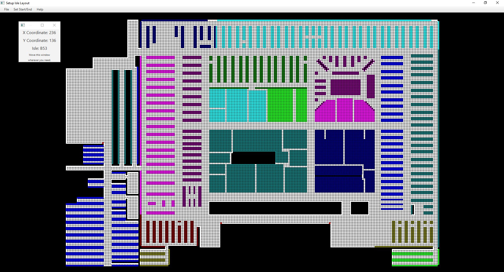

# Store Layout App

As of September 3rd, 2021, I work and have worked at a certain department store of a certain company since December of 2020. There, my job is to roam the store, locating and collecting various items for guest orders. I would get a list of locations in the store in a certain order, and it would be my job to go to each of those locations to collect each item until I had every item. In my time there, I have encountered three problems that directly affected the rate at which I could traverse the store and pick each item.

# Problems

In order of severity:

 1. In the store's database, some isles were in a vastly different location from reality.
	* For example one isle, D99, was in one corner of the store in the store's system when in reality it was in the opposite corner. Thus, I was directed away from that isle only to return to that location when I was originally very close.
 2. The starting point of a batch of items is often nowhere near the first location in the batch.
	 * I often had to traverse the entire store just to get to the first location in the batch, passing many other locations in the process.
 3. The overall path of locations through the store did not make sense to me, and I often manipulated the list to save time.

# Solution

So, being a computer science student at Pitt, I spent some time thinking and imagining and I thought of a solution that could solve all three of these problems. Introducing, the **Store Layout App**.

## Revisiting the Problems

 1. This app allows a manager or someone in charge of the store to layout the isles in their correct locations, even changing the layout quickly when isles change their location in the store.
 2. This app has a `Set Start/End` feature to place the start and end point (these are always the same) in their correct locations in the store so these can be taken into account when planning the route.
 3. I have implemented my own path finding algorithm which I believe is better than the one currently being used. More details to come.

# How It Works

The backing data structure is a 2-D array of `RNodes` (Rectangle Nodes) that represent two feet of actual size. The layout of the store can be recreated by highlighting certain areas of cells and designating them as isles. In addition, inaccessible areas can also be created by `Filling In` certain areas in the 2-D array. These two functions serve to help the user recreate, as accurately as possible, the layout of the store. 

Isles can be `Setup` to hold certain information relevant to how many locations the isle holds. This app breaks down that information into `Sections` and `Subsections`. 

The locations of the isles on the 2-D array and their `Sector` and `Subsection` information combine to return a cell in the 2-D array, in the form of coordinates (23,75), that correlates to an item's location in the store.

Finally a modified version of a nearest neighbor algorithm is used to generate a sorted list of locations that would be returned to someone like me working in the store. The algorithm splits up the store into four sectors. Given the starting location (problem #2) as the first sector, an order of sectors is determined. Every location given is sorted into these sectors. Then, a nearest neighbor algorithm is applied to visit each location in the current sector until all locations in that sector have been visited. Dijkstra's is used for finding the quickest path between locations. Then the algorithm moves onto the next sector. The cycle continues until all locations in the last sector have been visited, where this final location will always be somewhat close to the start/end location. It's basically a big circle that returns to start. 

Finally, the user can save and load files from disc to easily change the layout, or to save their work to come back to it later.

# Code Structure

I have split up my code into packages.

 - **GraphsAndHelpers** contains code for creating a graph of the 2-D array and finding the quickest path. The main code can be found in GraphOfTheGrid.java and all other classes within this package are helper classes that are called from GraphOfTheGrid.java.
 - **GridData** holds the backing 2-D array. The main file is GridData3.java, and all other sub classes are helpers that contain more information for each isle, isle group, and cell.
 - **HelperClasses** are a few helpful classes for small improvements in coding and readability across all packages.
 - **UserInterface** contains fxml files for every UI and controllers associated with each fxml. In addition, there are pictures that are shown with instructions and other helpful information.

# Final Notes

There are a couple of things that I cannot do simply because I do not have access to the company's database. Thus, this app is as complete as it can possibly be without that information.

All of this work is 100% my own. The idea, the UI, and the code are all mine. I use some of the company's terminology because this is designed for one of their stores.

I have fully tested this app on one store's layout and aim to test it on another before I give it the all clear. 

I realize that this java app may not be compatible with the company's systems, of which I have no knowledge. This app is simply an idea and implemented solution to a real life problem that I encountered, and I believe it would not be hard for me to import this to another format so that it could be used.

Finally, there are some minor performance issues, but all of them come from javafx's implementation of the node class and accessing multiple nodes at once.

I hope you can take the time to read all my code. I've spent eight months of free time working on this and I enjoyed every second of it. Thanks, and enjoy!
